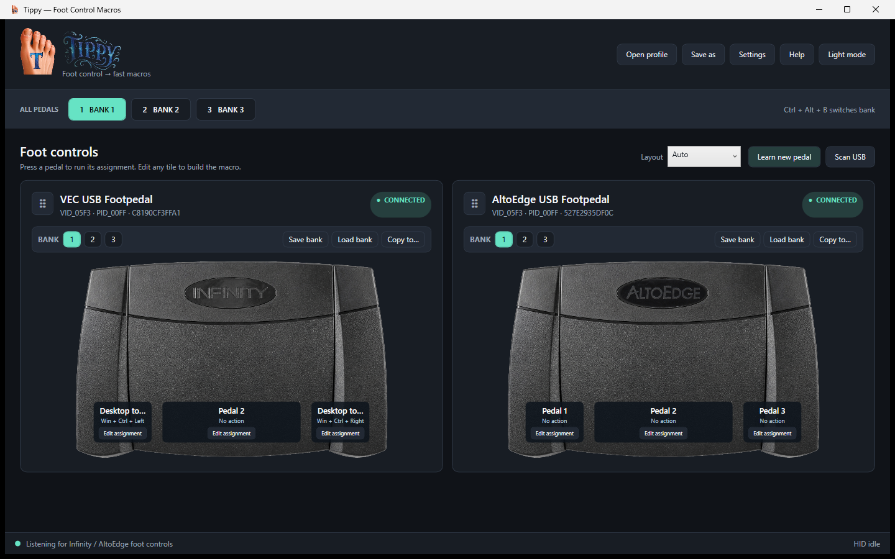
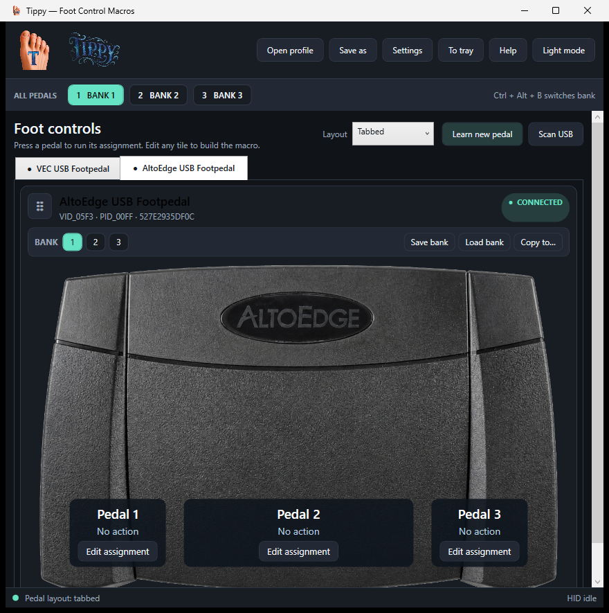
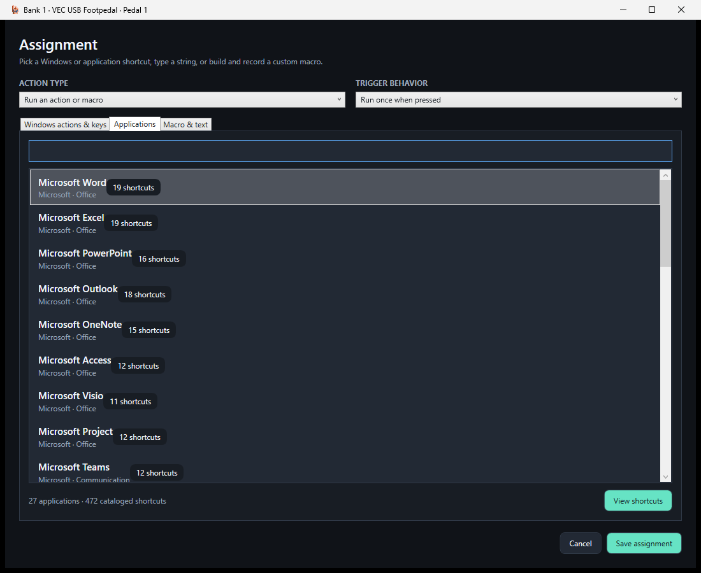

<p align="center">
  
</p>

<h1 align="center">Tippy</h1>

<p align="center">
  <strong>Turn USB transcription pedals into fast, low-latency keyboard, mouse, macro, and gamepad controls.</strong>
</p>

<p align="center">
  <a href="https://github.com/TerkWerX/TIPPY/actions/workflows/windows-ci.yml"></a>
  <a href="https://github.com/TerkWerX/TIPPY/releases/latest"></a>
  
  
</p>

Tippy is a Windows 11 utility for people who want useful work and gameplay controls under their feet without dragging along a full transcription suite. It supports multiple pedals at once, gives every connected pedal its own three macro banks, and makes assignments visible at a glance.

The [compatibility and reliability direction](docs/COMPATIBILITY.md) documents Tippy's support tiers, safety guarantees, hardware limits, and roadmap for bringing additional USB pedals back into useful service.

> Tippy is under active development. The Infinity IN-USB-2 Version 14 and AltoEdge IN-AE-S Version 14 are the first verified devices; the built-in learning wizard can teach Tippy additional raw-HID controls with 1–32 digital switches.

## See Tippy in action



Each pedal has independent banks, realistic switch placement, live press illumination, reusable bank files, and drag-and-drop placement that can match the pedals on your floor.

<details>
<summary><strong>Use the dedicated compact tabbed mode</strong></summary>



Tabbed mode shows one full-size pedal at a time and deliberately contracts the surrounding interface to a smaller footprint than normal one-pedal mode. Every tab retains its banks, bank tools, live illumination, and assignment buttons. Tabs and pedal handles remain draggable.

</details>

<details>
<summary><strong>Browse application-specific shortcuts</strong></summary>



The searchable catalog currently includes 557 commands across 32 Windows applications, including Microsoft Office, Adobe creative tools, Blender, GIMP, Maya, Ableton Live, Reason, REAPER, Audacity, OBS Studio, Streamlabs Desktop, vMix, XSplit Broadcaster, Wirecast, VS Code, VLC, and more. Live-production entries use clearly labeled paired bindings: assign the same shortcut inside the streaming application, then let Tippy send it from a pedal.

</details>

## Highlights

- Use two or more compatible USB pedals simultaneously with separate assignments.
- Keep three independent banks on every pedal, or switch all pedals together.
- Save, load, and copy portable `.tippy-bank.json` banks to any pedal with enough switches—including loading the same bank on several pedals.
- Assign Windows actions, individual keys, key combinations, text strings, timed recordings, delays, mouse actions, program launches, and optional Xbox 360 gamepad buttons.
- Give every switch independent press and release actions, or hold keyboard/gamepad output until physical release.
- Hold a pedal as a momentary shift layer so the other switches temporarily use another bank.
- Assign separate double-tap and long-press actions, repeat a command while held, or turn a held action into a safe toggle.
- Build cross-device foot combinations and ordered foot sequences manually or record them by pressing the real pedals.
- Select independent banks automatically for the foreground Windows application, resolved only when a pedal is pressed.
- Send MIDI notes/CC/program changes and OSC messages to DAWs, streaming tools, lighting software, and other creative applications.
- Hold continuous cursor movement, vertical/horizontal scrolling, and mouse-button drags underfoot.
- Arrange pedal cards automatically, stacked, side by side, or in a tile grid with automatic or 1–6-column placement.
- Use a distinct compact tabbed mode to show one full-size pedal at a time without losing its controls.
- Drag pedal cards or compact tabs to match their physical order.
- Reopen on the same monitor at the previous position and size; layout changes stay anchored to that monitor instead of recentering.
- See the pressed switch illuminate in real time.
- Switch between dark and light themes.
- Send Tippy to the system tray while its pedal assignments continue running.
- Learn unknown USB HID pedals without a driver or code change.
- Use the bundled registry-driven artwork library, choose a picture manually for any device, and preserve unknown VID/PID details for future compatibility updates.
- Learn keyboard-emulating pedals through device-specific Windows Raw Input without remapping the user's main keyboard.
- Preview assignments without producing output in Rehearsal Mode.
- Show an optional click-through active-bank/action overlay and inspect raw events, simultaneous switches, and routing latency in Live Diagnostics.
- Keep automatic profile backups, restore earlier setups, run portably from a USB drive, and install checksum-verified pedal support packs.
- Hot-plug devices without restarting Tippy.

## Download and run

1. Download the Windows x64 ZIP from the [latest release](https://github.com/TerkWerX/TIPPY/releases/latest).
2. Extract the entire ZIP to a folder you control.
3. Run `Tippy.exe`.
4. Plug in a supported pedal and choose **Edit assignment** on a switch.

The release is self-contained, so a separate .NET installation is not required. Tippy currently ships unsigned; Windows SmartScreen may ask you to confirm the first launch.

## Supported pedals

| Device | Status | USB identity |
|---|---|---|
| VEC Infinity IN-USB-2 Version 14 | Verified | `VID_05F3`, `PID_00FF` |
| AltoEdge IN-AE-S Version 14 | Verified | `VID_05F3`, `PID_00FF` |
| Other standard USB HID pedals | Learnable | Use **Learn new pedal** |

The two verified pedals use the same three-button HID protocol. Tippy distinguishes simultaneous physical devices so each can keep its own layout, banks, and assignments.

## Assignments and banks

Choose **Edit assignment** to search Windows or application shortcuts, type a string, capture a key combination, or record a timed sequence. Select Bank 1, 2, or 3 inside a pedal card to change only that pedal. The **All pedals** bank buttons and default `Ctrl+Alt+B` shortcut switch every connected pedal together.

Every switch can have both a press action and a separate release action. Press actions can tap once or hold keyboard/gamepad output until physical release. Held outputs are reference-counted across simultaneous pedals and are released automatically if a pedal disconnects; **Release all held inputs** is also available from Tippy's tray menu.

Assign **Switch to next bank** for hands-free cycling, or **Hold for temporary bank** for a true momentary shift layer. Use **App profiles** to map each pedal to an independent bank when a selected executable is foreground. Use **Save bank**, **Load bank**, or **Copy to…** to reuse a setup on any compatible connected pedal.

The advanced behavior panel on every assignment can add a double-tap or long-press action, repeat the press action, or toggle a held action. Timing is adjustable per switch, and Tippy rejects ambiguous combinations such as toggle-plus-double-tap instead of guessing. Under **Tools**, foot patterns can combine switches across multiple pedals or recognize an ordered sequence. **Capture with feet** records the pattern from the connected hardware.

The macro editor also supports continuous mouse movement and scrolling, MIDI note-on/note-off, CC, and program-change messages, plus OSC output. **Tools → MIDI output setup** selects a specific Windows MIDI endpoint and sends a real note-on/note-off test. Text and program fields can use `{date}`, `{time}`, `{clipboard}`, `{app}`, `{profile}`, `{device}`, `{pedal}`, `{bank}`, and custom `name=value` profile variables.

Tippy autosaves its live profile here:

```text
%LOCALAPPDATA%\Tippy\default.tippy.json
```

Portable profiles use `.tippy.json`; portable banks use `.tippy-bank.json`.

## Learn another pedal

1. Select **Learn new pedal** beside **Scan USB**.
2. Pick the device from the HID list. Likely pedal devices are marked with a star.
3. Choose the number of digital switches, from 1 through 32.
4. Keep each switch released while Tippy arms it, then capture it when prompted.
5. Save the mapping and begin assigning actions immediately.

The learned definition stores USB identity, a report-descriptor fingerprint, and switch rules. It does not record normal keyboard typing.

Pedals that enumerate as keyboards can be learned separately under **Tools → Learn keyboard-style pedal**. Tippy registers for Windows Raw Input and stores only the selected physical device path plus the virtual key emitted by each foot switch. Choose the device carefully: selecting a normal keyboard would intentionally map keys from that keyboard.

Tippy also ships a data-driven pedal picture registry. The shared `VID_05F3/PID_00FF` identity cannot distinguish every Infinity/VEC/AltoEdge rebadge, so Tippy asks for the matching picture once and remembers the answer for that physical USB device. The **Picture** button permits a manual override at any time. Unknown or not-yet-verified hardware is recorded locally in `unknown_pedals.log` beside the development library, or under `%LOCALAPPDATA%\Tippy` in an installed copy.

## Creative control and safety

**Rehearsal Mode** runs the complete recognition and visual-feedback path but suppresses keyboard, mouse, program, MIDI, OSC, gamepad, and text output. It is useful for learning a complicated foot layout safely. The optional click-through overlay announces active application profiles, banks, gestures, and pattern actions without stealing focus from the working application or game.

Tippy enforces configurable limits on macro duration, repeat duration, and step count. The default emergency stop is `Ctrl+Alt+Escape`; it cancels playback and releases held keyboard, mouse, and gamepad state. Live Diagnostics keeps at most 500 recent raw pedal events in memory and can export a privacy-safe support report containing device descriptors and timing—never typed text or macro contents.

Automatic profile backups are retained under the active Tippy data directory. Portable mode is enabled from **Tools → Profile backups & portable mode** and takes effect after restarting. Checksum-verified `.tippy-pedal-pack.zip` libraries can update identity data and artwork without installing executable plug-ins. See [advanced interactions](docs/ADVANCED_INTERACTIONS.md) and the [pedal support-pack format](docs/PEDAL_SUPPORT_PACKS.md).

## Gamepad output and game rules

Keyboard and mouse output works through the Windows `SendInput` API. Genuine XInput output requires an existing ViGEmBus 1.22 installation; Tippy can detect and test it under **Settings** but does not install a kernel driver.

Some games and anti-cheat systems reject injected input. A conservative gameplay setup maps one pedal press to one ordinary key. Timed or multi-step automation may be prohibited even in casual modes, so the game's rules always take precedence.

## Build from source

Requirements: Windows 11 x64 and the .NET 8 SDK or newer.

```powershell
git clone https://github.com/TerkWerX/TIPPY.git
cd TIPPY
dotnet build Tippy.slnx
dotnet test Tippy.slnx
dotnet run --project src/Tippy.App/Tippy.App.csproj
```

Create the self-contained release:

```powershell
dotnet publish src/Tippy.App/Tippy.App.csproj `
  -c Release -r win-x64 --self-contained true `
  -o dist/Tippy-win-x64
```

The device probe lists HID descriptors and live reports:

```powershell
dotnet run --project tools/Tippy.DeviceProbe/Tippy.DeviceProbe.csproj -- 20
```

See [the device protocol notes](docs/DEVICE_PROTOCOL.md) for the verified Version 14 report format. Contributions are welcome—start with [CONTRIBUTING.md](CONTRIBUTING.md).

## Project layout

```text
src/Tippy.App/          WPF interface, HID service, input playback, and catalogs
src/Tippy.Core/         Profiles, banks, macro models, and report decoders
tests/Tippy.Core.Tests/ Decoder and profile tests
tools/Tippy.DeviceProbe HID discovery and protocol diagnostic tool
assets/                 Mascot, branding, pedal art, and Windows icon suite
docs/                   Protocol notes and project screenshots
```

## Acknowledgments

Tippy was inspired by the idea of using purpose-built macro utilities with unconventional input devices, then shaped around transcription pedals those utilities did not recognize. Product and application names are trademarks of their respective owners. Tippy is not affiliated with VEC, AltoEdge, Microsoft, Adobe, Autodesk, Ableton, or the other cataloged software vendors.
